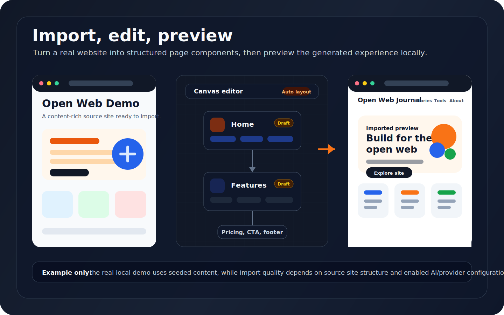
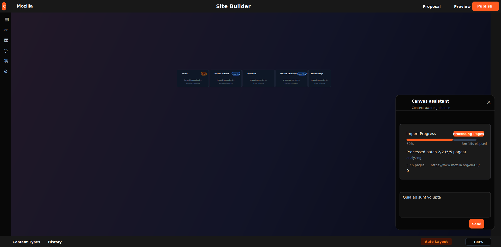
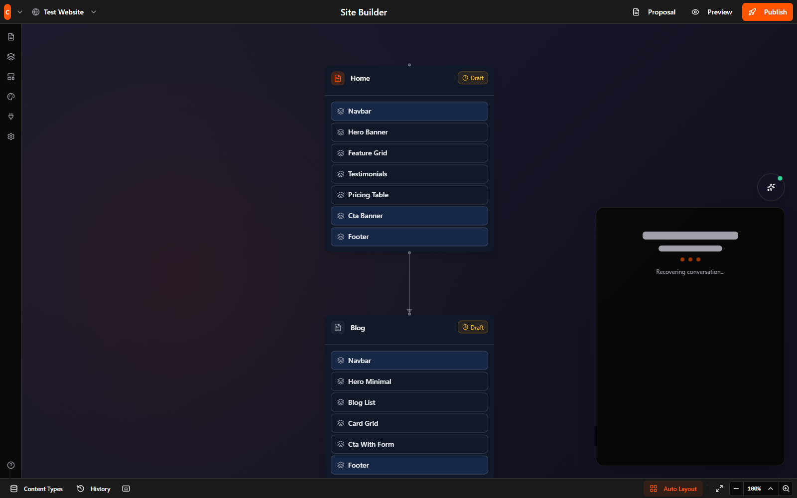
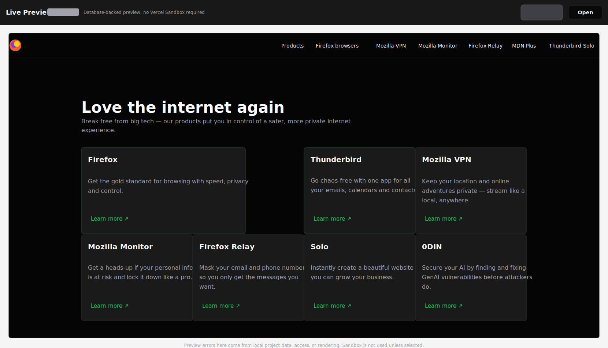
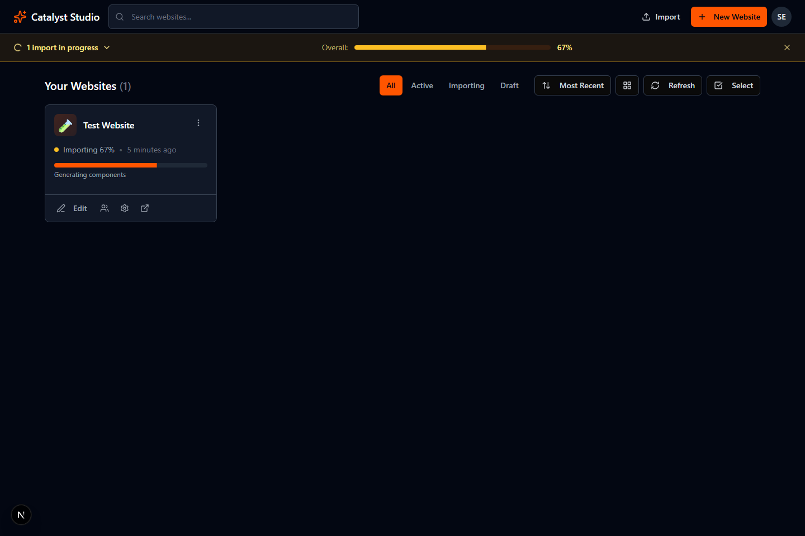
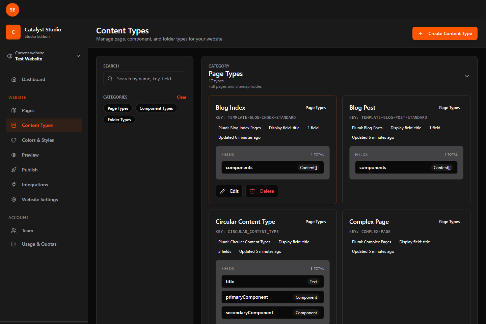
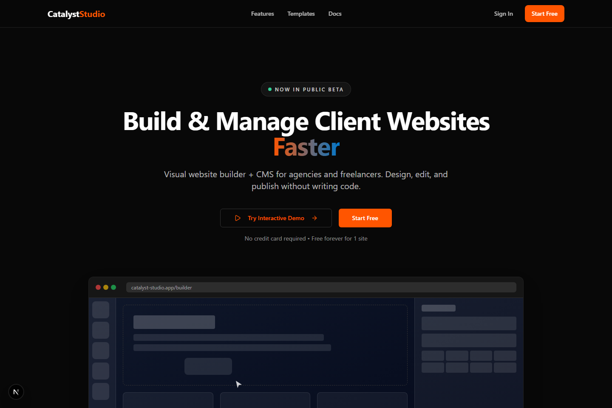
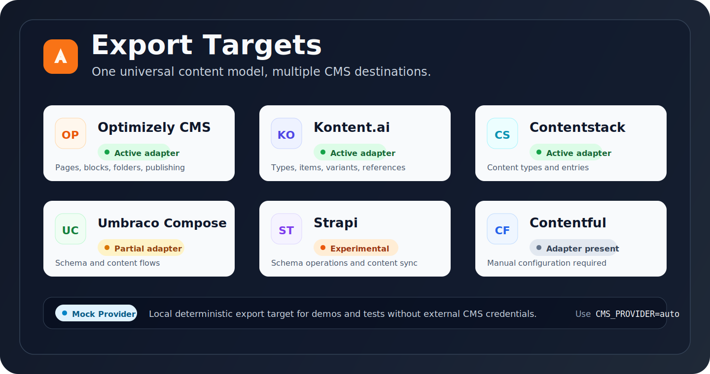

# Catalyst Studio

[](https://opensource.org/licenses/Apache-2.0)
[](https://nodejs.org/)
[](https://github.com/catalystx/catalyst-studio-oss/actions/workflows/ci.yml)

**AI-powered visual website studio and CMS.** Import any live site with AI, edit visually, preview instantly, and export to the CMS your clients already use — or run it as a complete standalone CMS with a GraphQL headless API.

Fully hackable locally. Core features (visual builder, preview, content modeling, seeded demos) run without any paid services or API keys.

> **Verify the local demo (no API keys required):** `npm run verify:quickstart` — one command spins up the seeded path, checks it, and exits cleanly.

> **Runtime requirement:** Node.js 24.x with npm. Use the checked-in `.nvmrc` or `.node-version` and run `npm run db:generate` after every fresh `npm ci`.

## Key Features

### AI Creation & Migration
- **Import live websites** — AI analyzes pages, detects reusable components, extracts navigation/shared elements, and pulls the design system.
- **Generate new sites from prompts** (greenfield) — Creates information architecture first, then populates real pages and components.
- In-builder conversational AI assistant that can create pages, edit components, and modify structure.

### Visual Site Builder
- Drag-and-drop site hierarchy (pages, folders, reparenting) powered by React Flow.
- Large library of 60 production CMS components (heroes, navigation, blog, contact, pricing, features, etc.).
- Global/shared components with live overrides and one-click propagation to all instances.
- Rich property editing, undo/redo, auto-save, search/jump, responsive modes, and proposals.

### Full CMS + Structured Content
- Per-site Content Types for structured data modeling.
- Design system extraction, concepts, tokens, and scoped theming.
- Media library with usage tracking across pages and shared components.
- Built-in live preview using the database-backed renderer (no external dependencies required).

### Headless & Delivery
- **Use it as a headless CMS** — Full GraphQL API (UCS) that serves pages, structure, shared components, design tokens, and resolved media.
- Public site rendering included (`[...slug]`).
- Same resolved content model powers preview, export, and headless consumption.

### Universal Export to Other CMS Platforms
Model content once in Catalyst Studio, then push to your client's existing CMS.

Active provider adapters:
- **Optimizely CMS** (full schema-first support for pages, blocks, folders, shared components)
- **Kontent.ai**
- **Contentstack**
- **Umbraco Compose** (partial)
- **Strapi** (experimental)
- Mock provider for local testing

### Collaboration & Professional Features
- Team members, invitations, and role-based access (owner/admin/member) with per-website scoping.
- Scoped API keys with rotation and audit events.
- Usage tracking, quotas, and deployment history.
- GitHub Actions production deployment to Vercel with protected migrations. See [GitHub deployment setup](docs/deployment/github.md).
- Activity streams and audit logs.

Everything is extensible: add new CMS components, customize the component library, or add new export providers.

## See It In Action

**AI-Powered Import from Live Websites**



**Visual Site Builder**


**Live Database-Backed Preview**


**Dashboard & Content Types**



**Landing Page**


## Multiple Ways to Use Catalyst Studio

- **As a complete visual CMS** — Build and manage sites entirely inside the studio with instant preview. No export needed.
- **As a headless GraphQL CMS** — Any frontend (Next.js, Nuxt, custom, etc.) can query the UCS GraphQL API for pages, structure, and components.
- **As an AI migration/import tool** — Point it at an existing website and get a structured, editable version in minutes.
- **As a universal content modeling layer** — Define once, then export/publish to whatever CMS your client uses.

## Quickstart (Simplest Possible)

The easiest way to run everything locally:

```bash
npm run verify:quickstart
```

This **one command** does all of the following, then shuts the app and Compose services down:
- Starts a PostgreSQL database using Docker Compose
- Generates the Prisma client
- Applies migrations
- Seeds a full demo account + sample website with pages and components
- Starts the app (on port 3100)
- Verifies the sign-in flow works

To explore the app interactively after verification, run the manual setup in [docs/setup.md](docs/setup.md), then open **http://localhost:3000/sign-in** and use the seeded demo account:

```
Email:    seed@example.com
Password: SeedUser!234
```

**Recommended places to explore immediately:**
- Dashboard: http://localhost:3000/dashboard
- Visual Site Builder: http://localhost:3000/studio/site-builder?websiteId=test-website
- Live Preview: http://localhost:3000/studio/preview?websiteId=test-website
- Content Types: http://localhost:3000/studio/content-types?websiteId=test-website

**You do not need any API keys** for the seeded demo, visual builder, preview, content types, or local rendering.

### Quick Demo Walkthrough

Follow these 6 steps after the manual setup in [docs/setup.md](docs/setup.md) to experience the full AI-powered visual + headless flow from one model (the seeded `test-website` is real, editable, and powers preview, export, and the UCS GraphQL API):

1. Sign in at http://localhost:3000/sign-in with the seeded demo account:
   ```
   Email:    seed@example.com
   Password: SeedUser!234
   ```

2. Go to the Dashboard at http://localhost:3000/dashboard and use the "Try these features with the seeded demo site" cards (direct links to the seeded `test-website`):
   - Visual Site Builder: http://localhost:3000/studio/site-builder?websiteId=test-website
   - Live Database-Backed Preview: http://localhost:3000/studio/preview?websiteId=test-website
   - Content Types & CMS: http://localhost:3000/studio/content-types?websiteId=test-website
   - Export & Headless: http://localhost:3000/studio/deployment?websiteId=test-website (plus the "Explore Headless GraphQL (UCS) on seeded test site" sub-link in that card or the welcome area above)

3. In the Site Builder, click the floating Sparkles button (bottom-right) to open the in-canvas AI assistant. Try a simple prompt such as "add a hero to home" or "make the main nav global" — it operates on the real seeded pages, components, and globals (core drag-drop, props, and hierarchy require no keys).

4. Open (or refresh) Live Preview in a second tab: see your edits appear instantly. The preview uses the exact same database-backed renderer and resolved content model that headless consumers and the public site see.

5. In Settings → API Access (via the "Explore Headless GraphQL (UCS) on seeded test site" sub-link in the dashboard's Export & Headless card or the welcome text above), use the prominent "Headless GraphQL API (UCS)" card: click "Try it now (copy curl)". It demonstrates querying the *same model* (pages + components + sharedComponents + designSystems) you just edited visually. Generate a website-scoped key in the table below and paste it to run the curl against `test-website`.

6. (Optional) Explore Content Types to inspect the structured modeling, or Deployment for universal export (mock provider is active in the seeded demo — model once, push anywhere).

This proves the value prop in minutes: AI-powered visual editing and headless GraphQL from a single editable CMS model, with live preview and universal export — all without any API keys for the core seeded experience.

### Optional Setup (AI Features + Exports)

- **AI import & generation** (recommended for real use): Add an `OPENROUTER_API_KEY` (free tier available at openrouter.ai). Only needed for import/greenfield/AI assistant features.
- **Exporting to real CMS platforms**: Configure credentials for Optimizely, Kontent, Contentstack, etc. The local demo uses the built-in mock provider by default.

Full manual instructions, using your own PostgreSQL, troubleshooting, and advanced configuration are in [docs/setup.md](docs/setup.md).

## Export Providers

Catalyst Studio lets you model content once and push it to the CMS your clients already use.



| Provider          | Status          | Notes |
|-------------------|-----------------|-------|
| Optimizely CMS    | Active (full)   | Schema-first for pages, folders, blocks, shared components, and publishing. |
| Kontent.ai        | Active          | Full support for content types, items, variants, and component references. |
| Contentstack      | Active          | Creates content types and entries. |
| Umbraco Compose   | Partial         | Schema and content flows supported (media upload still in progress). |
| Strapi            | Experimental    | Requires a running Strapi instance and admin credentials. |
| Contentful        | Available       | Adapter exists (manual configuration required). |
| Mock              | Development     | Local deterministic provider — perfect for demos and testing. |

Use `CMS_PROVIDER=auto` (default) or set a specific provider (e.g. `CMS_PROVIDER=kontent`).

## Documentation

- [Setup Guide](docs/setup.md) — Full instructions, own database, troubleshooting, and advanced configuration.
- [Architecture Notes](docs/architecture.md) — High-level code layout (mainly for contributors).
- [Node 24 Stabilization Notes](docs/release-notes/node-24-stabilization.md) — Breaking setup, dependency, and deploy migration notes.
- [Contributing](CONTRIBUTING.md)

## Useful Commands

```bash
npm run verify:quickstart   # One-command full local setup + verification
npm run dev                 # Generate Prisma, build component registry, then start development
npm run db:generate         # Regenerate Prisma client after npm ci or schema changes
npm run build:components    # Regenerate the CMS component registry (run after editing components)
npm run db:seed             # Re-seed demo data
```

## Contributing

Issues and pull requests are welcome. Please keep changes scoped, add focused tests for behavior changes, and follow the directory and import conventions in [AGENTS.md](AGENTS.md).

## License

Licensed under the [Apache License 2.0](LICENSE).

---

**Catalyst Studio** — Model once. Edit visually. Deliver anywhere. Or just use it as your CMS.
